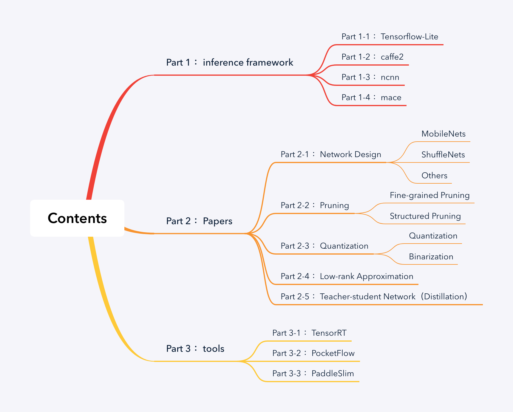
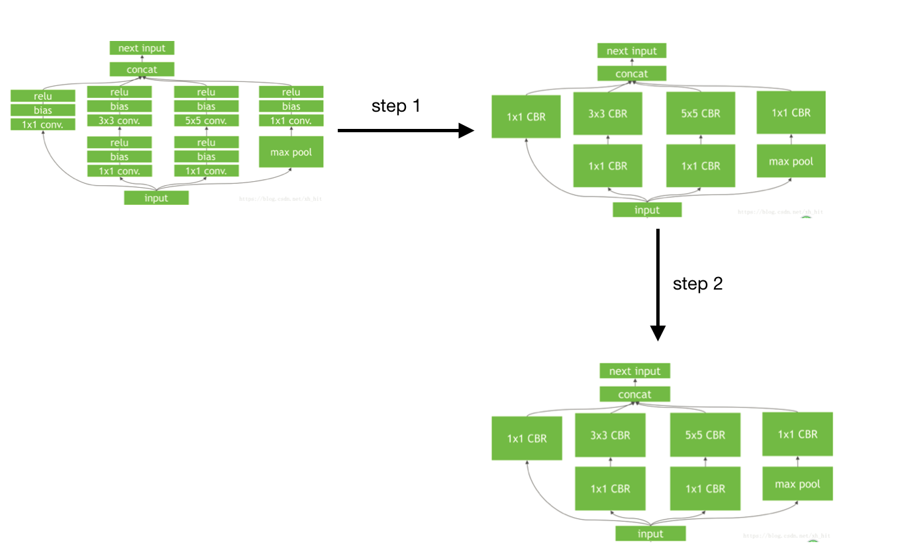

# Not-Awesome model compressing

## Contents

## Part 1 ：inference framework

### Part 1-1 ：[Tensorflow-Lite](https://www.tensorflow.org/lite)

#### adding...

### Part 1-2 ：[caffe2](https://caffe2.ai)

#### adding...

### Part 1-3 ：[ncnn](https://github.com/Tencent/ncnn)

#### adding...

### Part 1-4 ：[mace](https://github.com/XiaoMi/mace)

#### adding...

## Part 2 ：Papers

###  Part 2-1 ：Network Design

* #### MobileNets

  ##### 1、Efficient Convolutional Neural Networks for Mobile Vision Applications [MobileNets](https://arxiv.org/abs/1704.04861)

  ##### 2、MobileNetV2: Inverted Residuals and Linear Bottlenecks [MobileNetV2](https://arxiv.org/pdf/1801.04381.pdf)

  ##### 3、Searching for MobileNetV3 [MobileNetV3](https://arxiv.org/pdf/1905.02244.pdf) 

* #### ShuffleNets

  ##### 1、An Extremely Efficient Convolutional Neural Network for Mobile Devices [ShuffleNet](https://arxiv.org/abs/1707.01083)

  ##### 2、ShuffleNet V2: Practical Guidelines for Efficient CNN Architecture Design [ShuffleNet V2](https://arxiv.org/abs/1807.11164)

  ##### 3、ShuffleNetV2+：[paper unrelease](https://github.com/hekesai/real-time-network/blob/master)

* #### Others

  ##### adding........

### Part 2-2 ：Pruning

* #### Fine-grained Pruning

  ##### 1、[Deep Compression:Compressing Deep Neural Networks with Pruning, Trained Quantization and Huffman Coding](https://arxiv.org/abs/1510.00149)   [github](https://github.com/songhan/Deep-Compression-AlexNet)  (2016)

  ##### 2、[Dynamic Network Surgery for Efficient DNNs](http://arxiv.org/abs/1608.04493)  [github](https://github.com/yiwenguo/Dynamic-Network-Surgery)  （2016）

  ##### 3、[The Lottery Ticket Hypothesis: Finding Sparse, Trainable Neural Networks](https://arxiv.org/abs/1803.03635)  [github](https://github.com/google-research/lottery-ticket-hypothesis)  （2019）

* #### Structured Pruning

  ##### 1、[Pruning Filters for Efficient ConvNets](https://arxiv.org/abs/1608.08710)  [github](https://github.com/Eric-mingjie/rethinking-network-pruning/tree/master/imagenet/l1-norm-pruning)  (2017)

  ##### 2、[Filter Pruning via Geometric Median for Deep Convolutional Neural Networks Acceleration](https://arxiv.org/abs/1811.00250)  [github](https://github.com/he-y/filter-pruning-geometric-median)  (2019)

### Part 2-3 ：Quantization

* #### Quantization

  ##### 1、[Quantized Convolutional Neural Networks for Mobile Devices](https://arxiv.org/abs/1512.06473)

  ##### 2、[Towards the Limit of Network Quantization](https://arxiv.org/abs/1612.01543)

  ##### 3、[Quantized Neural Networks: Training Neural Networks with Low Precision Weights and Activations](https://arxiv.org/abs/1609.07061)

  ##### 4、[Compressing Deep Convolutional Networks using Vector Quantization](https://arxiv.org/abs/1412.6115)

* #### Binarization

  ##### 1、[Binarized Convolutional Neural Networks with Separable Filters for Efficient Hardware Acceleration](https://arxiv.org/abs/1707.04693)

  ##### 2、[Binarized Neural Networks: Training Deep Neural Networks with Weights and Activations Constrained to +1 or -1](https://arxiv.org/abs/1602.02830)

  ##### 3、[Local Binary Convolutional Neural Networks](https://arxiv.org/abs/1608.06049)

  ##### 4、[XNOR-Net: ImageNet Classification Using Binary Convolutional Neural Networks](https://arxiv.org/abs/1603.05279)

  ##### 5、[DoReFa-Net: Training Low Bitwidth Convolutional Neural Networks with Low Bitwidth Gradients](https://arxiv.org/abs/1606.06160)

### Part 2-4 ：Low-rank Approximation

##### 1、[Speeding up convolutional neural networks with low rank expansions](http://www.robots.ox.ac.uk/~vgg/publications/2014/Jaderberg14b/jaderberg14b.pdf)

##### adding...

### Part 2-5 ：Teacher-student Network（Distillation）

##### 1、[Distilling the Knowledge in a Neural Network](https://arxiv.org/abs/1503.02531)

##### adding...

## Part 3 ：tools

### Part 3-1 ：[TensorRT](https://docs.nvidia.com/deeplearning/sdk/tensorrt-developer-guide/index.html)

* #### 简介

* #### 框架介绍

* #### 基本原理

####       在计算资源并不丰富的嵌入式设备上，TensorRT之所以能加速神经网络的的推断主要得益于两点：

#####        1、首先是TensorRT支持int8和fp16的计算，通过在减少计算量和保持精度之间达到一个理想的trade-off，达到加速推断的目的。

#####        2、更为重要的是TensorRT对于网络结构进行了重构和优化，主要体现在一下几个方面。

#####       (1) TensorRT通过解析网络模型将网络中无用的输出层消除以减小计算。

#####             (2) 对于网络结构的垂直整合，即将目前主流神经网络的Conv、BN、Relu三个层融合为了一个层，例如将图1  所示的常见的Inception结构重构为图2所示的网络结构。

#####             (3) 对于网络结构的水平组合，水平组合是指将输入为相同张量和执行相同操作的层融合一起，例如图2向图3的转化。

 

* #### 性能

### Part 3-2 ：[PocketFlow](https://github.com/Tencent/PocketFlow)

* #### 简介

* #### 框架介绍

* #### 基本原理

* #### 性能

### Part 3-3 ：[PaddleSlim](https://github.com/PaddlePaddle/models/tree/v1.4/PaddleSlim)

* #### 简介

* #### 框架介绍

* #### 基本原理

* #### 性能

